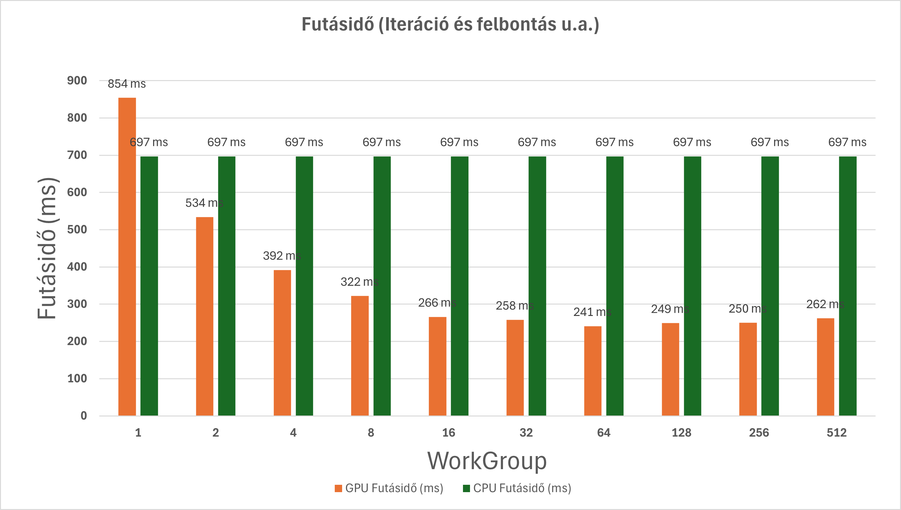
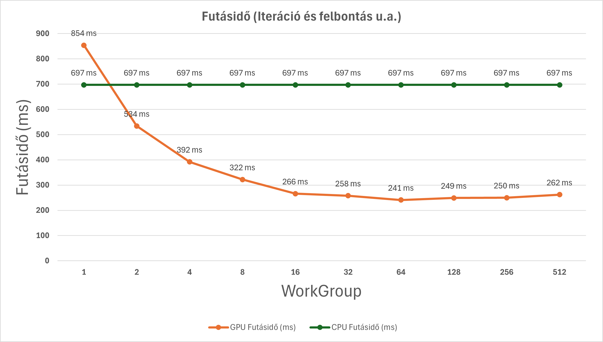
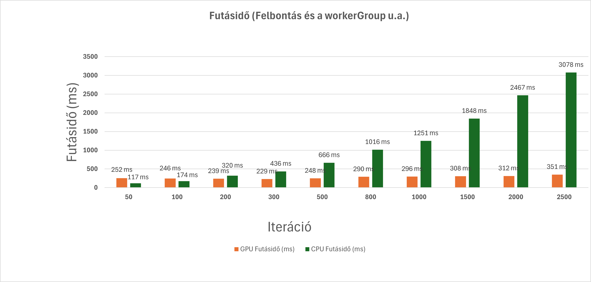
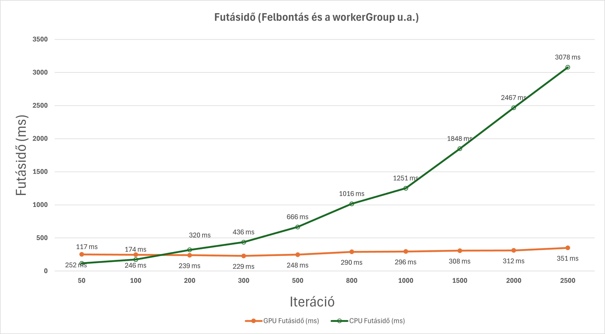
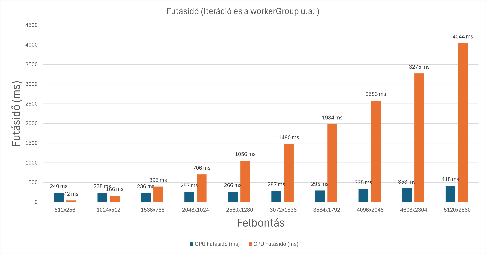
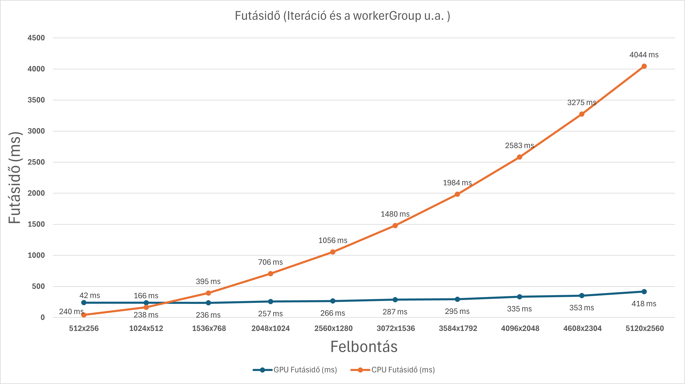

# par_dev_2026
**Parallel development Repo**

**Beadandó témája:**

C#-ban készült Mandelbrot-halmazon alapuló képgenerálás a választott feladatom. A program lényege, hogy a képpontokhoz kiszámolja, melyek tartoznak a halmazhoz, majd az eredmények alapján elkészíti a képet. A mérési eredmények a futási időt fogják reprezentálni a következő szempontok alapján:
    - workerGroup-ok nagységa szerint
    - iteráció mennyisége szerint
    - kép felbontása szerint

**Mérések:**

**Szekvenciálisan**
 **2048x1024 felbontásra: ~ 697 ms (ez az átlag marad végig amikor az iterációt és felbontást u.a. hagyjuk)** 

**Iteráció és felbontás u.a.**

| WorkerGroup | Iteráció | Felbontás     | Futásidő (ms) | Szekvenciális (ms) | Gyorsítás (ms) | Gyorsítás (%) |
|-------------|----------|---------------|---------------|---------------------|----------------|---------------|
| 1           | 500      | 2048x1024     | 854           | 697                 | -157           | -22.53%       |
| 2           | 500      | 2048x1024     | 534           | 697                 | 163            | 23.39%        |
| 4           | 500      | 2048x1024     | 392           | 697                 | 305            | 43.76%        |
| 8           | 500      | 2048x1024     | 322           | 697                 | 375            | 53.80%        |
| 16          | 500      | 2048x1024     | 266           | 697                 | 431            | 61.84%        |
| 32          | 500      | 2048x1024     | 258           | 697                 | 439            | 63.00%        |
| 64          | 500      | 2048x1024     | 241           | 697                 | 456            | 65.42%        |
| 128         | 500      | 2048x1024     | 249           | 697                 | 448            | 64.27%        |
| 256         | 500      | 2048x1024     | 250           | 697                 | 447            | 64.13%        |
| 512         | 500      | 2048x1024     | 262           | 697                 | 435            | 62.41%        |

Ha a WorkerGroup méretét növeljük és az iterációt, felbontást ugyanakkorára hagyjuk akkor látható, hogy a futásidő fokozatosan csökken. mindaddig amíg a group mérete nem kezd el túl nagy lenni. Érdemes megjegyezni,  hogy szekvenciális (CPU) futtatáshoz képest a GPU-s megoldás jelentős gyorsulást ad, mivel a pixelek számítása egymás után helyett párhuzamosan történik. Ez különösen a Mandelbrot esetében hatékony, mert minden pixel számítása független a többitől.

**Felbontás és a workerGroup u.a.**	

| WorkerGroup | Iteráció | Felbontás   | Futásidő (ms) | Szekvenciális (ms) | Gyorsítás (ms) | Gyorsítás (%) |
|-------------|----------|-------------|---------------|---------------------|----------------|---------------|
| 128         | 50       | 2048x1024   | 252           | 117                 | -135           | -115.38%      |
| 128         | 100      | 2048x1024   | 246           | 174                 | -72            | -41.38%       |
| 128         | 200      | 2048x1024   | 239           | 320                 | 81             | 25.31%        |
| 128         | 300      | 2048x1024   | 229           | 436                 | 207            | 47.48%        |
| 128         | 500      | 2048x1024   | 248           | 666                 | 418            | 62.76%        |
| 128         | 800      | 2048x1024   | 290           | 1016                | 726            | 71.46%        |
| 128         | 1000     | 2048x1024   | 296           | 1251                | 955            | 76.34%        |
| 128         | 1500     | 2048x1024   | 308           | 1848                | 1540           | 83.35%        |
| 128         | 2000     | 2048x1024   | 312           | 2467                | 2155           | 87.38%        |
| 128         | 2500     | 2048x1024   | 351           | 3078                | 2727           | 88.63%        |

Ha a WorkerGroup mérete és a felbontás ugyanakkora és az iterációt növeljük akkor látható hogy ameddig az iteráció nem túl nagy számú, addig gyorsul a futásidő, de ha már túl nagy lesz fokozatosan növekszik egyre jobban. Ez azért is megfigyelhető, mert a szekvenciális futásidő az iteráció növekedésével folyamatosan és jelentősen emelkedik.
A párhuzamos megoldás ezzel szemben kevésbé érzékeny az iteráció növekedésére, ezért nagyobb iterációszámnál egyre nagyobb különbség alakul ki a szekvenciális és a párhuzamos végrehajtás között.

**Iteráció és a workerGroup u.a.**

| WorkerGroup | Iteráció | Felbontás   | Futásidő (ms) | Szekvenciális (ms) | Gyorsítás (ms) | Gyorsítás (%) |
|-------------|----------|-------------|---------------|---------------------|----------------|---------------|
| 256         | 500      | 512x256     | 240           | 42                  | -198           | -471.43%      |
| 256         | 500      | 1024x512    | 238           | 166                 | -72            | -43.37%       |
| 256         | 500      | 1536x768    | 236           | 395                 | 159            | 40.25%        |
| 256         | 500      | 2048x1024   | 257           | 706                 | 449            | 63.60%        |
| 256         | 500      | 2560x1280   | 266           | 1056                | 790            | 74.81%        |
| 256         | 500      | 3072x1536   | 287           | 1480                | 1193           | 80.61%        |
| 256         | 500      | 3584x1792   | 295           | 1984                | 1689           | 85.13%        |
| 256         | 500      | 4096x2048   | 335           | 2583                | 2248           | 87.03%        |
| 256         | 500      | 4608x2304   | 353           | 3275                | 2922           | 89.23%        |
| 256         | 500      | 5120x2560   | 418           | 4044                | 3626           | 89.66%        |

Ha a WorkerGroup mérete és az iteráció ugyanakkora, és a felbontást növeljük, akkor látható, hogy amíg a felbontás (pixelszám) nem túl nagy, addig a futásidő kedvezően alakul, azonban egy bizonyos méret felett a futásidő jelentősen romlani kezd.A szekvenciális végrehajtás ezzel szemben a felbontás növekedésével folyamatosan és meredeken növekszik, mivel minden pixel feldolgozása egymás után történik.
Ennek következtében a gyorsítás kis felbontásoknál még alacsony vagy akár negatív is lehet, míg nagyobb felbontások esetén egyre jelentősebbé válik, mivel a párhuzamos feldolgozás előnye jobban kihasználható.

**Összegzés:**
A mérések alapján jól látható, hogy a Mandelbrot halmazon alapuló képgenerálás hatékonyan párhuzamosítható, mivel az egyes pixelek számítása egymástól függetlenül történik. Ennek köszönhetően a GPU-s megvalósítás jelentús gyorsulást eredményez a szekvenciális (CPU) feldolgozáshoz képest.

A workerGroup méretének növelésével kezdetben jelentős teljesítménynövekedés van, azonban egy bizonyos méret felett a futásidő már nem javul tovább, sőt rosszabb is lesz. Ez a hardver korlátainak és az ütemezési többletterhelésnek tudható be.

Az iterációk számának növelése növeli a számítási igényt, így nagyobb iterációszám esetén a futásidő is növekszik. Kis iterációszámnál azonban a GPU hatékonyaan képes kihasználni a párhuzamos végrehajtást.

A felbontás növelésével a feldolgozandó pixeleknek a száma is nő, ami közvetlenül növeli a futásidőt. Ugyanakkor kisebb felbontások esetében a GPU erőforrásai nem kerülnek teljes mértékben kihasználásra, ezért ott nem feltétlenül lineáris a teljesítménynövekedés.
